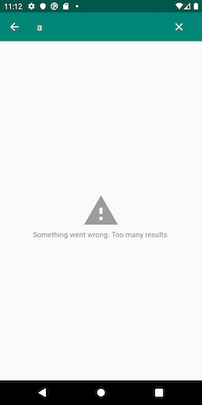
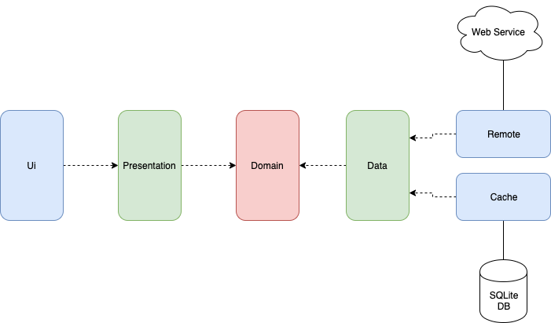

MVI Sample
===========
Android MVI sample

First of all
------------
Check out these articles, projects samples and videos
+ André Staltz: https://staltz.com/unidirectional-user-interface-architectures.html
+ Hannes Dorfmann: http://hannesdorfmann.com/android/mosby3-mvi-1
+ Benoît Quenaudon:
  - https://github.com/oldergod/android-architecture
  - https://www.youtube.com/watch?v=PXBXcHQeDLE
+ Joe Birch: https://github.com/bufferapp/android-clean-architecture-mvi-boilerplate
+ Etienne Caron: https://github.com/kanawish/android-mvi-sample

Description
-----------
A browser of movies

### Ui States

### Architecture
This is an approach of Clean Architecture by layer  

