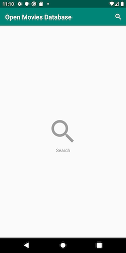
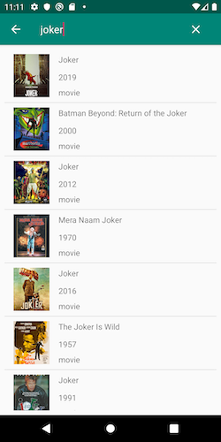
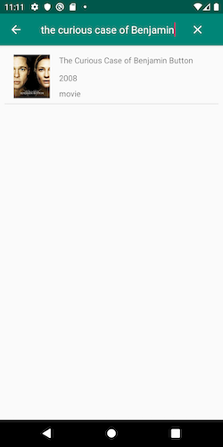

MVI Sample
===========
Android MVI sample which is based on RxJava and is composed by layers as modules.

**IMPORTANT**: If you want to see MVI sample with Kotlin Flow and by features, 
please go to this repo: https://github.com/4mr0m3r0/movies-modularization-sample
which uses *Movies API* as well.  

First of all
------------
Check out these articles, projects samples and videos
+ André Staltz: https://staltz.com/unidirectional-user-interface-architectures.html
+ Hannes Dorfmann: http://hannesdorfmann.com/android/mosby3-mvi-1
+ Benoît Quenaudon:
  - https://github.com/oldergod/android-architecture
  - https://www.youtube.com/watch?v=PXBXcHQeDLE
+ Joe Birch: https://github.com/bufferapp/android-clean-architecture-mvi-boilerplate
+ Etienne Caron: https://github.com/kanawish/android-mvi-sample

Description
-----------
You can search movies by title. The result will be a list, an error or an empty screen depending on what the API
result is.

### Ui States
#### Default

#### Loading

#### Success

#### Empty List

#### Error

### Architecture
This is an approach of Clean Architecture by layer  

